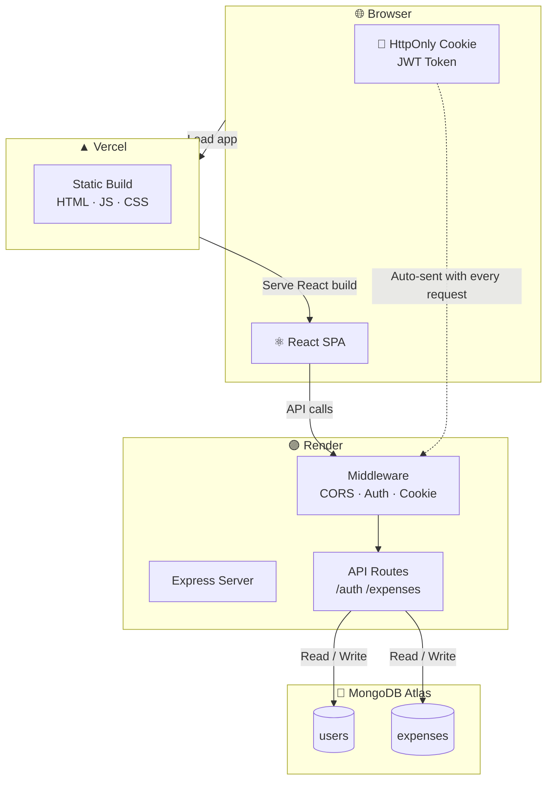
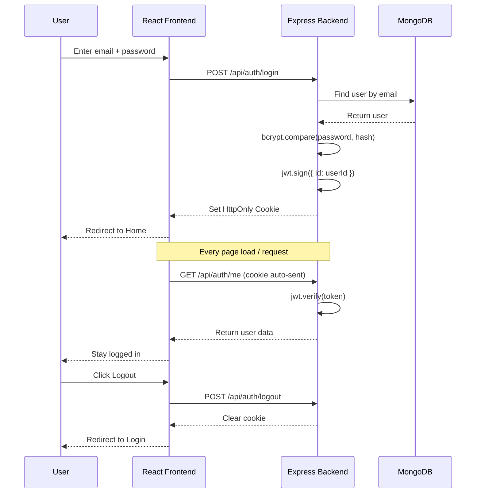

<div align="center">

#    Expensio

### A full-stack personal expense tracking application

[](https://expensio-chi.vercel.app)
[](https://github.com/Ayush-git403/Expensio)


</div>

---

## 📌 What is Expensio?

Expensio is a production-deployed full-stack web application for personal expense management. Users can register, log in securely, and track their expenses month by month on a clean yearly calendar view. All data is persisted in the cloud and accessible from any device.

---

## ✨ Features

- 🔐 **Secure Authentication** — Register and login with JWT stored in HttpOnly cookies
- 📅 **Yearly Calendar View** — 12-month grid showing total spending per month with progress bars
- 📋 **Monthly Expense View** — Click any month to view, add, edit and delete expenses
- 🏷️ **10 Expense Categories** — Food, Transport, Housing, Health, Entertainment, Shopping, Education, Travel, Utilities, Other
- 📊 **Summary Dashboard** — Total spent, active months, monthly average, busiest month
- 🌙 **Dark / Light Theme** — Toggle with preference saved in `localStorage`
- 📱 **Fully Responsive** — Works on mobile, tablet and desktop
- 🔒 **Session Security** — Session cookies cleared on browser close

---

## 🛠️ Tech Stack

### ⚛️ Frontend

**React 18** powers the entire UI as a single-page application. **Vite** is used as the build tool for fast development and optimized production builds. **React Router DOM** handles client-side navigation between pages. **Axios** manages all HTTP requests to the backend with automatic cookie handling. **Recharts** renders the pie and bar charts on the dashboard. Google Fonts **DM Sans** and **DM Serif Display** are used for typography.

### 🟢 Backend

**Node.js** is the runtime environment. **Express.js** handles all routing and middleware. **Mongoose** provides schema-based modelling on top of MongoDB. **bcryptjs** hashes all passwords before storing them — plain-text passwords are never saved. **jsonwebtoken** signs and verifies JWTs for authentication. **cookie-parser** reads the HttpOnly cookie on every incoming request. **dotenv** manages environment variables locally.

### ☁️ Database & Deployment

**MongoDB Atlas** is the cloud-hosted NoSQL database storing users and expenses. The **frontend is hosted on Vercel** with automatic deployments on every GitHub push. The **backend is hosted on Render** as a Node.js web service. Both platforms watch the GitHub `main` branch — pushing code auto-deploys to production.

---

## 📂 Project Structure

```
Expensio/
│
├── expensio/                        ← React Frontend (Vite)
│   ├── src/
│   │   ├── api/
│   │   │   └── axios.js             ← Axios instance with credentials
│   │   │
│   │   ├── components/
│   │   │   ├── Navbar.jsx           ← Sticky top bar with theme toggle
│   │   │   ├── MonthView.jsx        ← Monthly expense list + add form
│   │   │   └── ProtectedRoute.jsx   ← Auth guard for private pages
│   │   │
│   │   ├── context/
│   │   │   ├── AuthContext.jsx      ← Global user state + session check
│   │   │   └── ThemeContext.jsx     ← Dark/light theme token system
│   │   │
│   │   ├── hooks/
│   │   │   └── useWindowSize.js     ← Responsive breakpoint hook
│   │   │
│   │   ├── pages/
│   │   │   ├── Login.jsx            ← Login page
│   │   │   ├── Register.jsx         ← Registration page
│   │   │   └── Home.jsx             ← Yearly calendar dashboard
│   │   │
│   │   ├── utils/
│   │   │   └── helpers.js           ← Categories, colors, formatINR
│   │   │
│   │   ├── App.jsx                  ← Router + context providers
│   │   ├── App.css                  ← Global styles + fonts
│   │   └── main.jsx                 ← React DOM entry point
│   │
│   ├── vercel.json                  ← SPA routing rewrite rule
│   ├── vite.config.js
│   └── package.json
│
└── server/                          ← Node.js + Express Backend
    ├── middleware/
    │   └── authMiddleware.js        ← JWT verification on protected routes
    │
    ├── models/
    │   ├── User.js                  ← Mongoose user schema
    │   └── Expense.js               ← Mongoose expense schema
    │
    ├── routes/
    │   ├── auth.js                  ← /register /login /logout /me
    │   └── expenses.js              ← CRUD + month/year filtering
    │
    ├── .env                         ← Local secrets (gitignored)
    ├── index.js                     ← Express app entry point
    └── package.json
```

---


## 🏗️ Project Architecture



---

## 🔐 Authentication Flow



---


## 🚀 Local Setup

**1. Clone the repo**
```bash
git clone https://github.com/Ayush-git403/Expensio.git
cd Expensio/expensio
```

**2. Setup backend**
```bash
cd server
npm install
```

Create `server/.env`:
```
PORT=5000
MONGO_URI=your_mongodb_atlas_connection_string
JWT_SECRET=your_secret_key
NODE_ENV=development
```

```bash
npm run dev
```

**3. Setup frontend**
```bash
cd ..
npm install
```

Create `.env.local`:
```
VITE_API_URL=http://localhost:5000/api
```

```bash
npm run dev
# → http://localhost:5173
```

---

## 🌍 Deployment

Both services **auto-deploy on every `git push origin main`** — no manual steps needed.

**Backend → Render**
- Root Directory: `expensio/server`
- Start Command: `node index.js`
- Env vars: `MONGO_URI` · `JWT_SECRET` · `NODE_ENV=production`

**Frontend → Vercel**
- Root Directory: `expensio`
- Framework: Vite
- Env var: `VITE_API_URL=https://your-backend.onrender.com/api`

---

## 📈 Future Improvements

- [ ] Export expenses to CSV
- [ ] Budget alerts when nearing monthly limit
- [ ] Recurring expense templates
- [ ] Google OAuth login
- [ ] Charts on the monthly expense view
- [ ] Search and filter expenses by keyword

---

<div align="center">

Built with ❤️ by **Ayush** · March 2026

[Live App](https://expensio-chi.vercel.app) · [GitHub Repo](https://github.com/Ayush-git403/Expensio)

</div>
